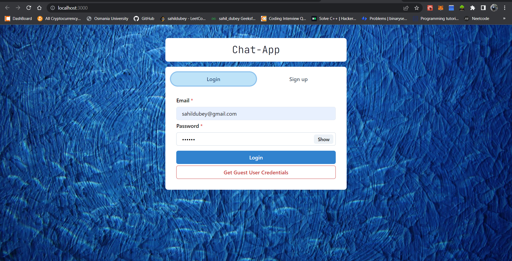
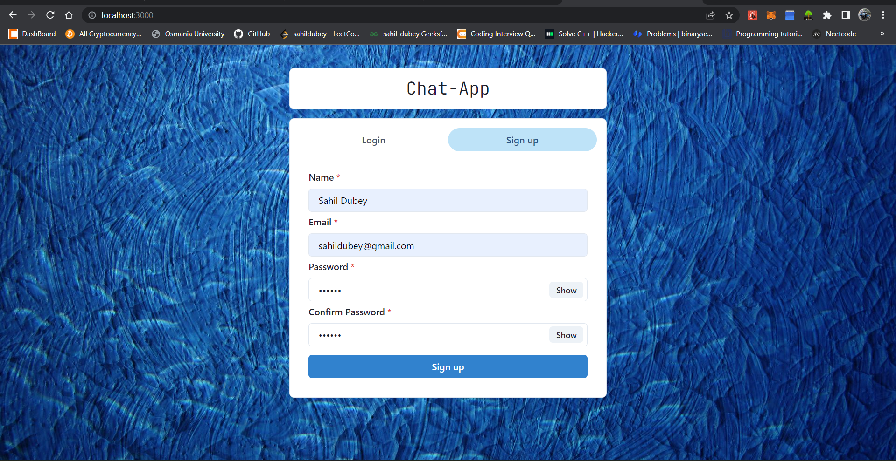
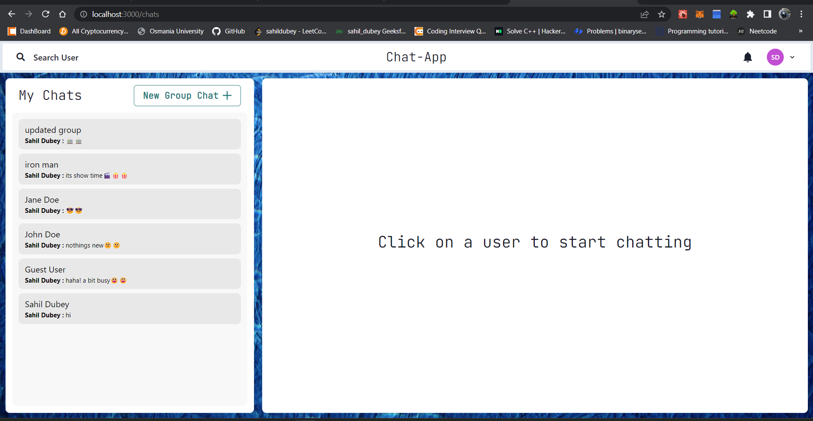
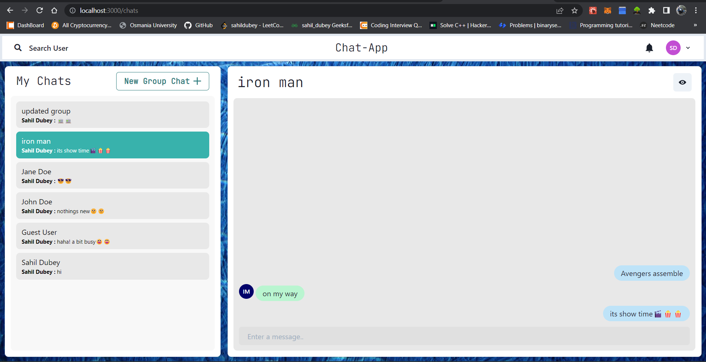
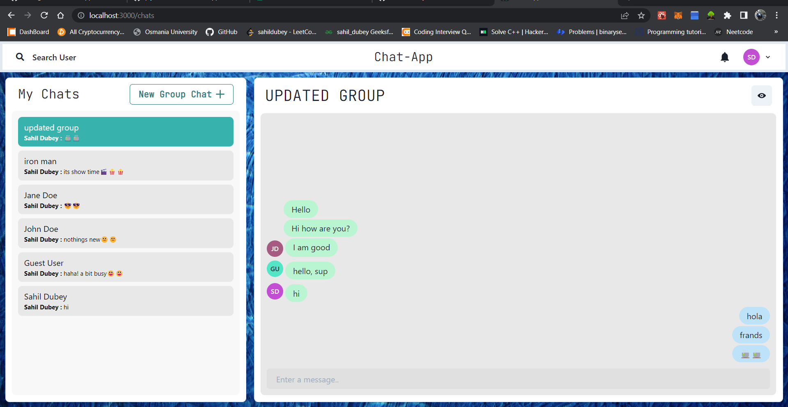
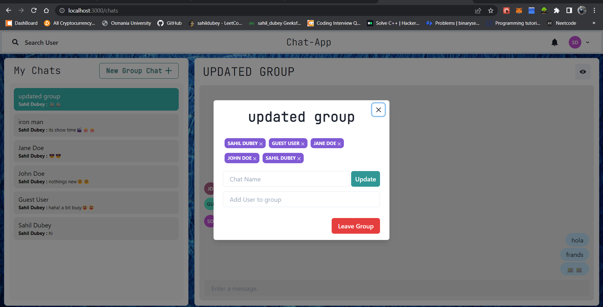
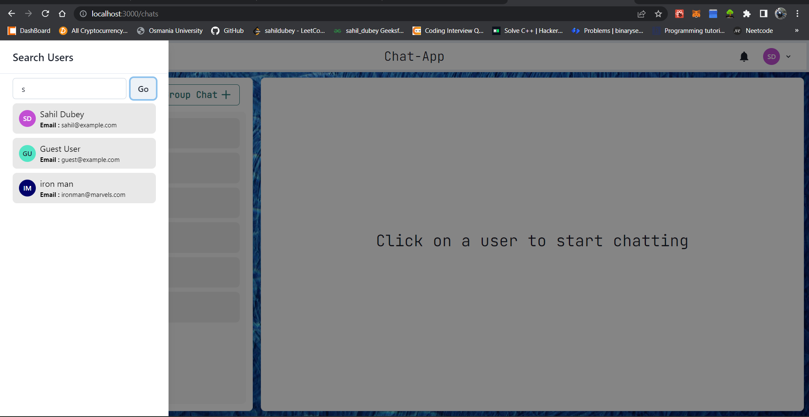
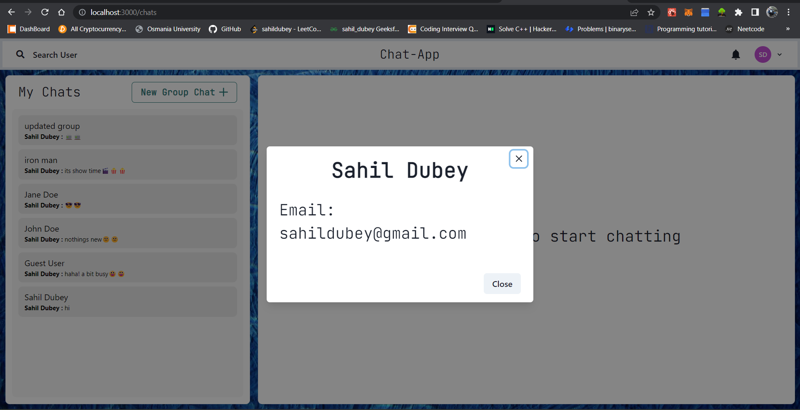

# Chat-App (In Progress)

This is a mobile responsive web application project 
made to help user to chat with there family, friends, relatives etc.

## Description

This Chat-App is a Full Stack Chat Application. Uses Socket.io for 
real time communication and stores user details in encrypted format 
in Mongo DB Database.


## Tech Stack

**Client:** React JS

**Server:** Node JS, Express JS

**Database:** Mongo DB


## Run Locally

Clone the project

```bash
  git clone https://github.com/sahildubeydev/fullstack-chat-application
```

Go to the project directory

```bash
  cd fullstack-chat-application
```

Install dependencies

```bash
  npm install
```

Start the server

```bash
  cd backend
  npm start
```

Start the client

```bash
  cd frontend
  npm start
```


## Features

- Light/dark mode toggle
- Live previews
- Fullscreen mode
- Cross platform


## Screenshots
Login Page


Signup Page


LoggedIn Page


One to One Chat 


Group Chat


Add/remove user, Leave group 


Search User


User Profile



## Author

- [@sahildubey](https://github.com/sahildubeydev)

